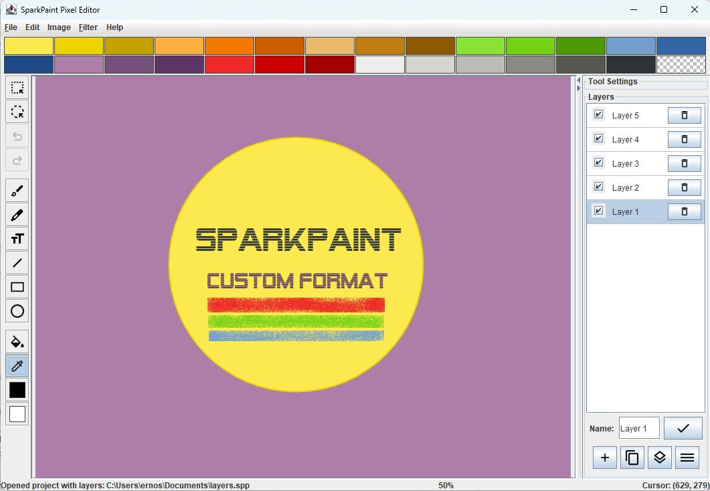

# SparkPaint

SparkPaint is a lightweight, Java-based image editing application with an intuitive interface and features needed for 
doodling and pixeling.

]

### Documentation

- 
- 

### Format Specification

- 

## Features

### Drawing Tools
- **Brush Tool**: Create soft strokes with adjustable size, shape, and blend strength
- **Pencil Tool**: Make precise pixel-perfect lines
- **Line Tool**: Draw straight lines, smooth curves, outlines, and filled shapes
- **Shape Tools**: Draw rectangles and circles/ellipses
- **Fill Tool**: Apply color to areas with adjustable tolerance and edge detection
- **Text Tool**: Add text to your images
- **Brush Filter**: Apply brush effects like blur, brighten, noise and dithering to images

### Selection Tools
- **Rectangle Selection**: Select rectangular areas
- **Freehand Selection**: Create custom-shaped selections
- **Magic Wand**: Select areas based on color similarity
- **Selection Operations**: Rotate, cut, copy, and paste with transparency support

### Layers
- **Layer Management**: Create, delete, and manage multiple layers
- **Layer Effects**: Basic layer adjustments like opacity, saturation, and brightness

### Color Management
- **Color Picker**: Select colors from your canvas
- **Dual Color System**: Use primary drawing color and secondary fill color

### Image Manipulation
- **Transparency Support**: Work with transparent backgrounds and selections
- **Undo/Redo**: 16-step history for reversing changes
- **Zoom**: Multiple zoom levels for detailed work (0.5x, 1x, 2x, 4x, 8x, 12x) with preview

### File Operations
- **Multiple Formats**: Load and save in PNG, JPG, and BMP formats
- **SparkPaint Format**: Save and load in SparkPaint's native format for layers and transparency
- **Clipboard Integration**: Cut, copy, and paste between applications

## Getting Started

1. Create a new image or open an existing one from the File menu
2. Select your tool from the toolbar
3. Customize tool settings in the panel below the toolbar
4. Draw on the canvas using your selected tool
5. Save your work when finished

## System Requirements

- Java Runtime Environment (JRE) 8 or higher
- 1GB RAM recommended (works with 512MB too)
- 50MB disk space (for the JRE)

## Development

SparkPaint is built using:
- Java with Swing/AWT for the user interface
- Java2D for image rendering and manipulation
- Maven for project management
- Claude 3.7 AI for code generation