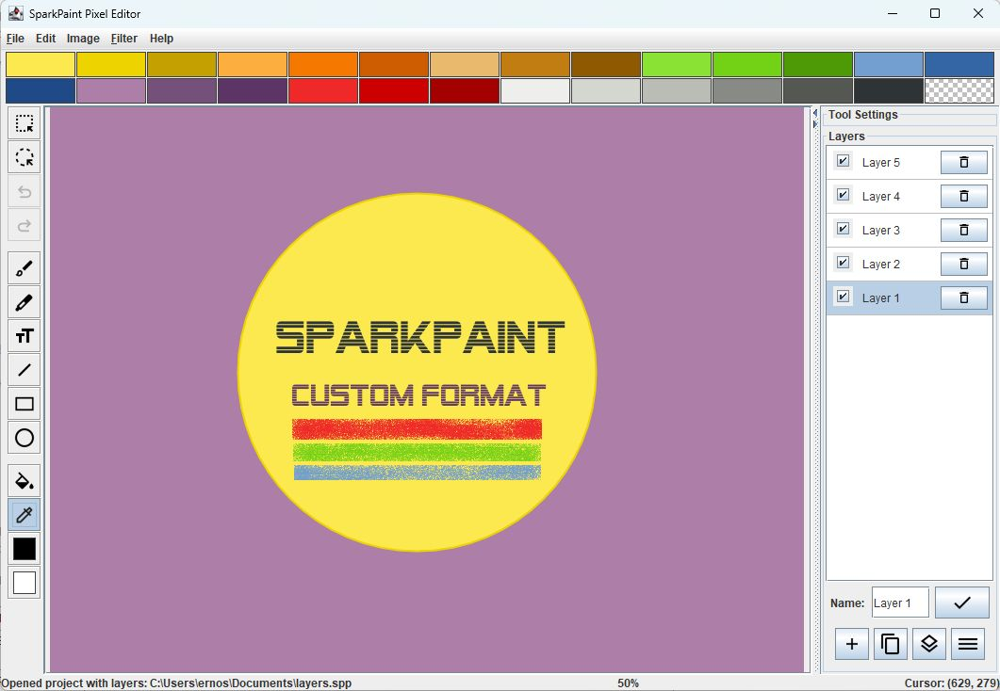
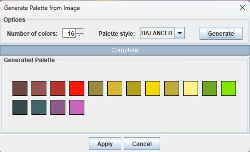
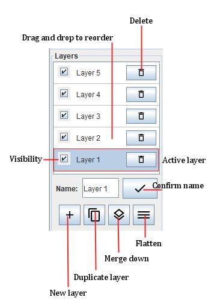
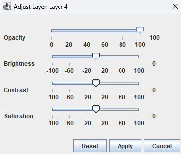

# SparkPaint Manual

## Overview

The SparkPaint application is designed to provide a user-friendly interface for creating and editing pixel art. Below is an overview of the main components of the application layout:

### Main Window

]

- **Title Bar**: Displays the application name, "SparkPaint Pixel Editor".
- **Menu Bar**: Located at the top of the window, it provides access to various menus such as File, Edit, Image, Filter, and Help.
- **Toolbar**: Positioned on the left side, it contains buttons for selecting different drawing tools like Brush, Pencil, Text, Line, Rectangle, Circle, Fill, and Eyedropper.
- **Canvas**: The central area where you create and edit your artwork. It supports zooming and scrolling for detailed work.
- **Tool Settings**: Located on the right side, it allows you to customize the settings for the selected tool, such as brush size, line thickness, and color options.
- **Layer Panel**: Also on the right side, it helps you manage multiple layers in your artwork, including adding, deleting, and reordering layers.
- **Color Palette**: Positioned at the top, it provides a range of colors to choose from for your drawing and fill needs.
- **Status Bar**: Located at the bottom, it displays messages, the current zoom level, and the cursor position on the canvas.

### Key Features

- **Drawing Tools**: A variety of tools for different drawing techniques, including brushes, pencils, text, lines, rectangles, circles, fills, and color picking.
- **Layer Management**: Allows you to work with multiple layers, making it easier to edit and organize your artwork.
- **Color Palette**: Offers a selection of colors and the ability to customize and save your own palettes.
- **Zoom and Preview**: Zoom in and out of the canvas for detailed work, with a preview of the whole image.
- **Undo/Redo**: Easily revert and reapply changes to your artwork, ensuring a smooth workflow.
- **Clipboard**: Supports cut, copy, and paste operations within the canvas.

This layout is designed to provide an intuitive and efficient environment for creating pixel art, with all the necessary tools and features easily accessible.

## Tools

| Tool             | Description                                                                                  |
|------------------|----------------------------------------------------------------------------------------------|
| Brush Tool       | The Brush Tool allows users to paint on the canvas with various brush shapes and sizes, supporting smooth edges and color blending. |
| Pencil Tool      | The Pencil Tool enables freehand drawing with adjustable line thickness, ideal for sketching and detailed work.                    |
| Text Tool        | The Text Tool lets users add text to the canvas with customizable fonts and sizes.                                                |
| Line Tool        | The Line Tool allows drawing straight lines, polylines, and smooth curves with adjustable thickness.                              |
| Rectangle Tool   | The Rectangle Tool is used to draw rectangles and squares, either filled or outlined.                                             |
| Circle Tool      | The Circle Tool enables drawing circles and ellipses, with options for filled or outlined shapes.                                 |
| Fill Tool        | The Fill Tool fills areas with solid colors or gradients, with adjustable color tolerance.                                        |
| Eyedropper Tool  | The Eyedropper Tool picks colors from the canvas for reuse in the artwork.                                                        |

## Using The Tools

### Brush Tool

The Brush Tool in SparkPaint allows users to paint on the canvas using various brush shapes and sizes. It supports different brush shapes, size adjustments, and anti-aliasing for smoother edges. The tool can also blend colors based on the specified blend strength.

#### Features

- **Brush Shapes**: Choose from square, circle, or spray shapes.
- **Size Adjustment**: Control the size of the brush for precise or broad strokes.
- **Spray Density**: Adjust the density of the spray for the spray brush shape.
- **Blend Strength**: Set the strength of color blending for smoother transitions.
- **Anti-Aliasing**: Enable or disable antialiasing for smoother edges.

#### How to Use

1. **Select the Brush Tool**: Choose the Brush Tool from the toolbar.
2. **Adjust Settings**: Use the Brush Tool Settings panel to customize the brush:
    - **Brush Shape**: Select the desired shape (Square, Circle, Spray) from the dropdown menu.
    - **Brush Size**: Adjust the size slider to set the brush size.
    - **Spray Density**: If using the spray shape, adjust the spray density slider.
    - **Blend Strength**: Adjust the blend strength slider to control color blending.
    - **Anti-Aliasing**: Check or uncheck the antialiasing option for smoother edges.
3. **Start Painting**: Click and drag on the canvas to paint with the selected settings.
4. **Apply Changes**: The changes will be applied immediately as you paint.

The Brush Tool is versatile and can be customized to suit various painting styles and needs.

### Pencil Tool

The Pencil Tool in SparkPaint allows users to draw freehand lines on the canvas. It is ideal for sketching and creating detailed drawings with precision.

#### Features

- **Line Thickness**: Adjust the thickness of the pencil line.
- **Anti-Aliasing**: Enable or disable antialiasing for smoother lines.

#### How to Use

1. **Select the Pencil Tool**: Choose the Pencil Tool from the toolbar.
2. **Adjust Settings**: Use the Pencil Tool Settings panel to customize the tool:
    - **Line Thickness**: Adjust the slider to set the thickness of the pencil line.
    - **Anti-Aliasing**: Check or uncheck the antialiasing option for smoother lines.
3. **Start Drawing**: Click and drag on the canvas to draw with the selected settings.
4. **Apply Changes**: The changes will be applied immediately as you draw.

The Pencil Tool is simple and straightforward to use.

### Text Tool

The Text Tool in SparkPaint allows users to add text to the canvas. It supports various fonts, sizes, and antialiasing for smoother text rendering.

#### Features

- **Text Input**: Enter the desired text to be displayed.
- **Font Selection**: Choose from a variety of fonts.
- **Font Size**: Adjust the size of the text.
- **Anti-Aliasing**: Enable or disable antialiasing for smoother text edges.

#### How to Use

1. **Select the Text Tool**: Choose the Text Tool from the toolbar.
2. **Adjust Settings**: Use the Text Tool Settings panel to customize the tool:
    - **Text**: Enter the text you want to display in the text field.
    - **Font**: Select the desired font from the dropdown menu.
    - **Font Size**: Adjust the font size slider to set the text size.
    - **Anti-Aliasing**: Check or uncheck the antialiasing option for smoother text edges.
3. **Placing Text**: Click on the canvas where you want the text to appear.
4. **Apply Changes**: The changes will be applied immediately as you type.

The Text Tool is simple but enables placing text on images with various text styles and needs.

### Line Tool

The Line Tool in SparkPaint allows users to draw various types of lines and curves on the canvas. It provides flexibility in creating straight lines, polylines, and smooth curves with different styles and thicknesses.

#### Features

- **Single Line**: Draws a straight line between two points.
- **Polyline**: Draws a series of connected straight lines.
- **Smooth Curve**: Draws a smooth curve through a series of points.
- **Closed Curve**: Draws a smooth, closed curve through a series of points.
- **Filled Curve**: Draws a smooth, closed curve and fills the enclosed area with color.

#### Controls

- **Line Type**: Select the type of line or curve you want to draw from the dropdown menu.
- **Line Thickness**: Adjust the thickness of the line using the slider.
- **Curve Tension**: For smooth curves, adjust the tension to control the curvature.
- **Anti-Aliasing**: Toggle antialiasing to smooth the edges of the lines and curves.

#### Usage

1. **Select the Line Tool**: Choose the Line Tool from the toolbar.
2. **Choose Line Type**: Use the settings panel to select the desired line type.
3. **Adjust Settings**: Set the line thickness, curve tension (if applicable), and toggle anti-aliasing.
4. **Draw on Canvas**:
    - For **Single Line**: Click to set the start point, drag to the end point, and release.
    - For **Polyline**: Click to set points sequentially. Right-click to finish the polyline.
    - For **Smooth Curve**, **Closed Curve**, and **Filled Curve**: Click to set control points. Right-click to finish the curve.

The Line Tool is versatile and easy to use, making it ideal for creating both simple and complex shapes in your artwork.

### Rectangle Tool

The Rectangle Tool in SparkPaint allows users to draw rectangles and squares on the canvas. It supports both filled and outlined shapes, and users can customize the tool to suit their drawing needs.

#### Features

- **Filled or Outlined**: Choose to draw filled rectangles or just the outline.
- **Line Thickness**: Adjust the thickness of the rectangle's outline.
- **Anti-Aliasing**: Enable or disable antialiasing for smoother edges.

#### How to Use

1. **Select the Rectangle Tool**: Choose the Rectangle Tool from the toolbar.
2. **Adjust Settings**: Use the Rectangle Tool Settings panel to customize the tool:
    - **Filled**: Check the "Filled" option to draw filled rectangles.
    - **Line Thickness**: Adjust the slider to set the thickness of the rectangle's outline.
    - **Anti-Aliasing**: Check or uncheck the antialiasing option for smoother edges.
3. **Start Drawing**: Click and drag on the canvas to draw a rectangle with the selected settings.
4. **Apply Changes**: The changes will be applied immediately as you draw.

The Rectangle Tool is versatile and can be customized to suit various drawing styles and needs.

### Circle Tool

The Circle Tool in SparkPaint allows users to draw circles and ellipses on the canvas. It supports both filled and outlined shapes, and users can choose to draw circles based on the center point or corner points.

#### Features

- **Draw Mode**: Choose between center-based or corner-based drawing.
- **Fill Option**: Draw filled circles or just the outline.
- **Line Thickness**: Adjust the thickness of the outline.
- **Anti-Aliasing**: Enable or disable anti-aliasing for smoother edges.

#### How to Use

1. **Select the Circle Tool**: Choose the Circle Tool from the toolbar.
2. **Adjust Settings**: Use the Circle Tool Settings panel to customize the tool:
    - **Draw Mode**: Select "Circle" for center-based drawing or "Ellipse" for corner-based drawing.
    - **Filled**: Check the "Filled" option to draw filled circles.
    - **Line Thickness**: Adjust the slider to set the thickness of the outline.
    - **Anti-Aliasing**: Check or uncheck the antialiasing option for smoother edges.
3. **Start Drawing**: Click and drag on the canvas to draw a circle or ellipse with the selected settings.
4. **Apply Changes**: The changes will be applied immediately as you draw.

The Circle Tool is versatile and can be customized to suit various drawing styles and needs.

### Fill Tool

The Fill Tool in SparkPaint allows users to fill areas of the canvas with a solid color or gradient. It supports different fill modes and color tolerance settings to suit various filling needs.

#### Features

- **Fill Modes**: Choose from Smart Fill, Entire Region, Gradient Fill, and Smart Gradient Fill.
- **Color Tolerance**: Adjust the tolerance to control how similar colors need to be filled.
- **Anti-Aliasing**: Enable or disable antialiasing for smoother edges.

#### How to Use

1. **Select the Fill Tool**: Choose the Fill Tool from the toolbar.
2. **Adjust Settings**: Use the Fill Tool Settings panel to customize the tool:
    - **Fill Mode**: Select the desired fill mode from the dropdown menu.
    - **Color Tolerance**: Adjust the slider to set the color tolerance.
    - **Anti-Aliasing**: Check or uncheck the antialiasing option for smoother edges.
3. **Start Filling**: Click on the canvas to fill the area with the selected settings.
4. **Apply Changes**: The changes will be applied immediately as you fill.

The Fill Tool is versatile and can be customized to suit various filling styles and needs.

### Eyedropper Tool

The Eyedropper Tool in SparkPaint allows users to pick colors from the canvas. It is useful for selecting and reusing colors from different parts of your artwork.

#### Features

- **Color Picking**: Pick any color from the canvas by clicking on it.
- **Set Drawing or Fill Color**: Use the left mouse button to set the drawing color and the right mouse button to set the fill color.

#### How to Use

1. **Select the Eyedropper Tool**: Choose the Eyedropper Tool from the toolbar.
2. **Pick a Color**: Click on the canvas to pick a color:
    - **Left Click**: Sets the drawing color.
    - **Right Click**: Sets the fill color.
3. **Apply Changes**: The selected color will be applied immediately.

The Eyedropper Tool is simple and effective for color selection and reuse in your artwork.

## Palette 

### Color Palette

The Color Palette in SparkPaint allows users to select and manage colors for their artwork. It provides a range of default colors and the ability to customize the palette to suit your needs.

#### Features

- **Default Colors**: A set of predefined colors is available for quick selection.
- **Custom Colors**: Users can add and modify colors in the palette.
- **Transparency**: Includes a swatch for selecting transparent color.

#### Controls

- **Select Color**: Click on a color swatch to set it as the drawing or fill color.
- **Modify Color**: Double-click a color swatch to open a color chooser dialog and select a new color.
- **Load Palette**: Load a saved palette from a file.
- **Save Palette**: Save the current palette to a file.
- **Restore Default Palette**: Reset the palette to the default colors.

#### Usage

1. **Select a Color**: Click on any color swatch to set it as the drawing color (left-click) or fill color (right-click).
2. **Modify a Color**: Double-click on a color swatch to open the color chooser dialog. Select a new color and click "OK" to update the swatch.
3. **Load a Palette**: Use the "Load Palette" option to load a previously saved palette from a file.
4. **Save a Palette**: Use the "Save Palette" option to save the current palette to a file for future use.
5. **Restore Default Palette**: Click the "Restore Default Palette" button to reset the palette to the default colors.

The Color Palette is a versatile tool that helps you manage and customize colors for your artwork efficiently.

### Painting with Transparency

Sparkpaint supports a simple form of transparency. The color palette includes a swatch for selecting transparent color. When you select this color, it will be used as the transparent color in your artwork.
Tools support transparency in the following ways: when you work on a layer, you can paint with the transparent color, and the transparent color will be used to erase pixels on the layer. The transparent color is also used when you fill an area with the Fill Tool.
So you can uncover a layer by painting with the transparent color, or you can fill an area with the transparent color to make it transparent.

### Palette Generator

]

The Palette Generator in SparkPaint allows users to create custom color palettes from their artwork. It analyzes the colors in the image and generates a set of representative colors that can be used for consistent and harmonious color schemes.

#### Features

- **Color Extraction**: Automatically extracts colors from the image to create a palette.
- **Palette Styles**: Offers different styles such as Balanced, Vivid, Pastel, Muted, Deep, and Playful to suit various artistic needs.
- **Customizable Color Count**: Users can specify the number of colors to include in the palette.

#### Controls

- **Number of Colors**: Adjust the number of colors in the palette using the spinner control.
- **Palette Style**: Select the desired style for the palette from the dropdown menu.

#### Usage

1. **Open Palette Generator**: Access the Palette Generator from the menu.
2. **Set Options**: Choose the number of colors and the palette style.
3. **Generate Palette**: Click the "Generate" button to create the palette.
4. **Preview Palette**: View the generated palette in the preview panel.
5. **Apply Palette**: Click "Apply" to use the generated palette in your artwork.

The Palette Generator simplifies the process of creating cohesive color schemes, making it easier to maintain a consistent look and feel in your projects.

## Selections

The selection system in SparkPaint allows users to select, modify, and manipulate specific areas of their artwork. This system provides tools for both rectangular and freehand selections, enabling precise control over the selected regions.

### Tools for Selection

1. **Rectangle Selection Tool**:
   - **Creating a Selection**: Click and drag to create a rectangular selection. The selection will be drawn from the starting point to the current cursor position.
   - **Moving a Selection**: To be able to move a selection, you have to copy or cut it first. Once you did so, click inside an existing selection and drag to move it to a new location.

2. **Freehand Selection Tool**:
   - **Creating a Selection**: Click and drag to draw a freehand path. The selection will follow the path drawn by the cursor.
   - **Moving a Selection**: To be able to move a selection, you have to copy or cut it first. Once you did so, click inside an existing selection and drag to move it to a new location.

### Managing Selections

- **Selecting All**: Use the "Select All" option to create a selection around all visible layers in the canvas.
- **Clearing a Selection**: Use the "Clear Selection" option to remove the current selection.
- **Deleting Selection Area**: Use the "Delete Selection Area" option to remove the selected area from the current layer.
- **Rotating a Selection**: Use the "Rotate Selection" option to rotate the selected content by a specified angle.
- **Flipping a Selection**: Use the "Flip Selection" option to flip the selected content horizontally or vertically.

### Interaction with Selections

- **Dragging**: To be able to move a selection, you have to copy or cut it first.  Click and drag inside the selection to move it.
- **Painting**: When a selection is active, painting will only affect the selected area. This allows for precise editing without affecting the rest of the artwork.

### Transformations

- **Rotate**: Rotate the selected area in 90-degree increments.
- **Flip**: Flip the selected area horizontally or vertically.

### Visual Feedback

- **Cursor Changes**: The cursor will change to indicate different actions, such as moving or resizing a selection.
- **Selection Outline**: The selected area will be highlighted with an outline to indicate its boundaries.

By using these tools and options, users can effectively manage and manipulate selections within their artwork, providing greater control and flexibility in their creative process.

## Layers

The layer system in SparkPaint allows users to manage multiple layers in their drawings. Each layer acts like a transparent sheet that can hold individual elements of the artwork. This system provides flexibility and control, enabling users to edit parts of their drawing without affecting other elements.

### Key Features

- **Add New Layers**: Users can add new layers to their project, allowing them to separate different parts of their artwork.
- **Duplicate Layers**: Users can duplicate existing layers, creating an exact copy that can be edited independently.
- **Delete Layers**: Users can delete layers that are no longer needed.
- **Reorder Layers**: Users can change the order of layers, moving them up or down in the stack.
- **Merge Layers**: Users can merge the current layer with the layer below it.
- **Flatten Layers**: Users can flatten all visible layers into a single layer, combining all elements into one.

### Layer Controls

]

#### Adding a New Layer

1. Click the "Add New Layer" button in the Layers panel.
2. A new layer will be added to the top of the layer stack.

#### Duplicating a Layer

1. Select the layer you want to duplicate from the Layers panel.
2. Click the "Duplicate Layer" button.
3. A copy of the selected layer will be added above the original layer.

#### Deleting a Layer

1. Select the layer you want to delete from the Layers panel.
2. Click the "Delete Layer" button.
3. Confirm the deletion in the dialog that appears.

#### Reordering Layers

1. Click and drag the layer you want to move in the Layers panel.
2. Drop the layer at the desired position in the stack.

#### Merging Layers

1. Select the layer you want to merge down.
2. Click the "Merge with Layer Below" button.
3. The selected layer will be combined with the layer directly below it.

#### Flattening Layers

1. Click the "Flatten All Layers" button in the Layers panel.
2. Confirm the action in the dialog that appears.
3. All visible layers will be combined into a single layer.

### Visibility and Naming

- **Toggle Visibility**: Click the checkbox next to a layer to show or hide it.
- **Rename Layers**: Click the layer name in the bottom of the Layers panel to edit it. Click the "OK" button to save the new name.

### Tips

- Use layers to separate different elements of your artwork for easier editing.
- Duplicate layers before making significant changes to preserve the original.
- Merge and flatten layers to simplify your project once you are satisfied with the individual elements.

### Adjusting Layer Properties

]

SparkPaint allows you to adjust various properties of individual layers to enhance your artwork. These adjustments include changing the opacity, brightness, contrast, and saturation of a layer.

#### How to Adjust Layer Properties

1. **Open Layer Properties**:
   - Select the layer you want to adjust from the **Layer Panel**.
   - Right-click on the layer and choose **Layer Properties** from the context menu.

2. **Adjust Opacity**:
   - Use the **Opacity** slider to change the transparency of the layer.
   - Moving the slider to the left decreases opacity, making the layer more transparent.
   - Moving the slider to the right increases opacity, making the layer more opaque.

3. **Adjust Brightness**:
   - Use the **Brightness** slider to make the layer lighter or darker.
   - Moving the slider to the left decreases brightness, making the layer darker.
   - Moving the slider to the right increases brightness, making the layer lighter.

4. **Adjust Contrast**:
   - Use the **Contrast** slider to change the difference between light and dark areas of the layer.
   - Moving the slider to the left decreases contrast, making the image flatter.
   - Moving the slider to the right increases contrast, making the image more vivid.

5. **Adjust Saturation**:
   - Use the **Saturation** slider to change the intensity of the colors in the layer.
   - Moving the slider to the left decreases saturation, making the colors more muted.
   - Moving the slider to the right increases saturation, making the colors more vibrant.

6. **Preview Changes**:
   - As you adjust the sliders, the changes will be previewed in real-time on the canvas.

7. **Apply or Cancel Changes**:
   - Click **Apply** to save the changes to the layer.
   - Click **Cancel** to discard the changes and revert to the original layer properties.

These adjustments help you fine-tune each layer to achieve the desired effect in your artwork.

## Undo/Redo System

The undo/redo system in SparkPaint allows users to easily revert and reapply changes made to their artwork. This feature is essential for correcting mistakes and experimenting with different drawing techniques without the fear of losing progress.

### Features

- **Undo**: Reverts the last action performed on the canvas.
- **Redo**: Reapplies the last undone action, restoring the canvas to its previous state.

### How to Use

1. **Undo an Action**:
   - Click the **Undo** button in the toolbar.
   - The last action performed on the canvas will be reverted.
   - You can undo multiple actions by clicking the **Undo** button repeatedly.

2. **Redo an Action**:
   - Click the **Redo** button in the toolbar.
   - The last undone action will be reapplied to the canvas.
   - You can redo multiple actions by clicking the **Redo** button repeatedly.

### Toolbar Controls

- **Undo Button**: Located in the toolbar, this button allows you to undo the last action. It is enabled only when there are actions to undo.
- **Redo Button**: Located in the toolbar, this button allows you to redo the last undone action. It is enabled only when there are actions to redo.

### Tips

- Use the undo feature to quickly correct mistakes without manually erasing or redrawing.
- Experiment with different tools and techniques, knowing you can easily revert changes if needed.
- The undo/redo system helps maintain a smooth workflow, allowing you to focus on creativity without worrying about making irreversible changes.

By utilizing the undo/redo system, you can enhance your drawing experience in SparkPaint, making it easier to create and refine your artwork.

### Working with images

#### Saving Files

SparkPaint allows you to save your artwork in various formats, including PNG, JPEG, and BMP. When you save your work, all visible layers are flattened into a single image file. This ensures that your artwork is preserved as you see it on the canvas.

To save your artwork:
1. Go to the **File** menu.
2. Select **Save As**.
3. Choose the desired file format (PNG, JPEG, BMP).
4. Specify the file name and location.
5. Click **Save**.

#### Loading Files

You can load existing images into SparkPaint to continue editing or to use them as a base for new artwork. When you load an image, it is placed on a single layer named "Background".

To load an image:
1. Go to the **File** menu.
2. Select **Open**.
3. Browse to the image file you want to load.
4. Click **Open**.

#### Custom SparkPaint File Format

SparkPaint also supports a custom file format (`.spp`) that preserves all layers and their properties. This format allows you to save your work with all layers intact, so you can continue editing them later.

To save your artwork in the SparkPaint format:
1. Go to the **File** menu.
2. Select **Save As**.
3. Choose the SparkPaint format (`.spp`).
4. Specify the file name and location.
5. Click **Save**.

To load a SparkPaint file:
1. Go to the **File** menu.
2. Select **Open**.
3. Browse to the SparkPaint file (`.spp`) you want to load.
4. Click **Open**.

Using the SparkPaint file format ensures that all your layers, including their order and visibility, are preserved, allowing you to continue your work exactly where you left off.

#### Resizing Images

Resizing an image in SparkPaint allows you to change the dimensions of your artwork. This can be useful if you need to make your image larger or smaller while maintaining the aspect ratio.

To resize an image:
1. Go to the **Image** menu.
2. Select **Resize...**.
3. Enter the new width and height for your image.
4. Check the **Maintain aspect ratio** option if you want to keep the proportions of your image.
5. Click **OK** to apply the changes.

#### Scaling Images

Scaling an image in SparkPaint allows you to change the size of your artwork by a percentage. This can be useful for uniformly enlarging or reducing the size of your image.

To scale an image:
1. Go to the **Image** menu.
2. Select **Scale...**.
3. Enter the percentage for the width and height scaling.
4. Check the **Maintain aspect ratio** option if you want to keep the proportions of your image.
5. Click **OK** to apply the changes.

Both resizing and scaling options help you adjust the size of your artwork to fit your needs.

## Clipboard

The clipboard functionality in our application allows users to cut, copy, and paste selections within the drawing canvas.

### Limitations

Image Format: The clipboard supports PNG format to preserve transparency. When copying from Sparkpaint, the image is 
stored in PNG format. Under Windows, most applications expect portable CF_DIB format (that does not support 
transparency), and do not accept PNG format.

Pasting from other applications generally works, but transparency might not be preserved.